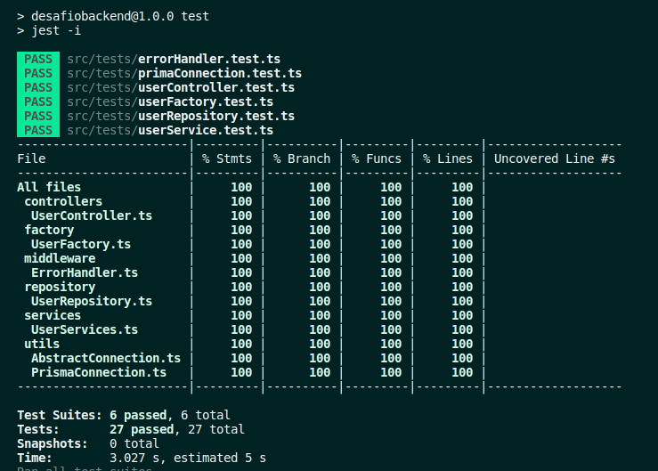

# CPFs API

Este projeto é uma API REST, CRD, seguindo os padrões SOLID, de cadastro, leitura e exclusão de CPFs num banco de dados

## Tecnologias utilizadas

- Prisma
- Docker
- PostgreeSQL
- TypeSript
- NodeJS
- Jest

## Instalação e uso

1.  Clone este repositório para sua máquina local
```bash
git clone git@github.com:pedroayresb/desafiobackend.git
```
2. Entre na pasta do projeto
```bash
cd desafiobackend
```
3.  Execute o compose
```bash
docker compose up
```
A aplicação utiliza as portas `3000`, `3002` e `5432` , certifique-se que elas estão disponíveis no momento de executar o comando.

## Testes
A aplicação possui testes unitários desenvolvidos para cobrir as suas principais camadas.
  

## Documentação da API

### Endpoint: `/users`

#### Método: `POST`

Descrição: Cria um novo usuário no banco de dados, desde que o CPF seja válido e único.

Request body:

```json
{
  "cpf": string
}
```

Parâmetros:

-   `cpf`: uma string contendo um número de CPF válido.

Respostas:

-   200 OK: Usuário criado com sucesso.
-   400 Bad Request: CPF inválido.
-   409 Conflict: Usuário já existe no banco de dados.

##### Exemplo do corpo da requisição:

```json
{
  "cpf": "91105533042" // exemplo de cpf válido
}
```

##### Exemplo de resposta de sucesso:

```json
{
  "cpf": "91105533042"
}
```
##### Exemplo de resposta de erro (CPF inválido):

```json
status: 400
{
  "error": "ERRInvalidCpf"
}
```
##### Exemplo de resposta de erro (usuário já existe):

```json
status: 409
{
  "error": "ERRUserAlreadyExists"
}
```
####  Método: `GET`

Descrição: Retorna um array com todos os CPFs cadastrados no banco de dados.

Respostas:

-   200 OK: Array retornado com sucesso.
##### Exemplo de resposta de sucesso:

```json
[
{
  "cpf": "91105533042"
},
...
]
```

### Endpoint: `/users/:cpf`

####  Método: `GET`

Descrição: Retorna o CPF,  desde que o CPF seja válido e cadastrado no banco.

Respostas:

-   200 OK: Usuário encontrado com sucesso.
-   400 Bad Request: CPF inválido.
-   404 Not Found: Usuário não existe no banco de dados.
##### Exemplo de resposta de sucesso:

```json
{
  "cpf": "91105533042"
}
```
##### Exemplo de resposta de erro (CPF inválido):

```json
status: 400
{
  "error": "ERRInvalidCpf"
}
```
##### Exemplo de resposta de erro (CPF não existe no banco):

```json
status: 404
{
  "error": "ERRUserDoesNotExists"
}
```
####  Método: `DELETE`

Descrição: Deleta o CPF,  desde que o CPF seja válido e cadastrado no banco.

Respostas:

-   200 OK: Usuário encontrado e deletado com sucesso.
-   400 Bad Request: CPF inválido.
-   404 Not Found: Usuário não existe no banco de dados.
##### Exemplo de resposta de sucesso:

```json
{
  "cpf": "91105533042"
}
```
##### Exemplo de resposta de erro (CPF inválido):

```json
status: 400
{
  "error": "ERRInvalidCpf"
}
```
##### Exemplo de resposta de erro (CPF não existe no banco):

```json
status: 404
{
  "error": "ERRUserDoesNotExists"
}
```
